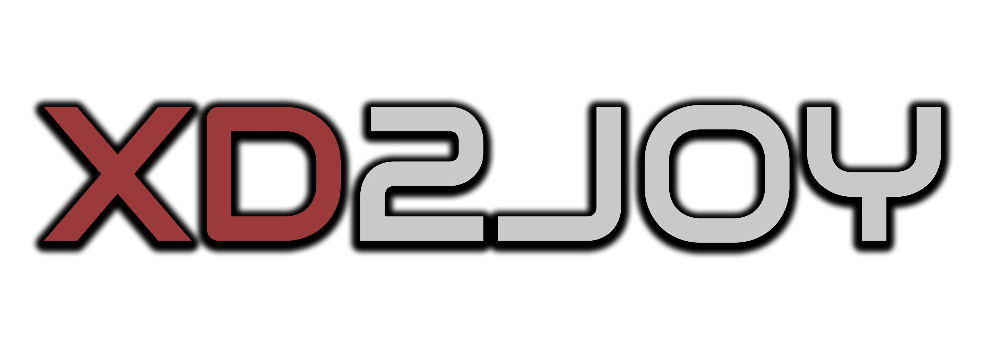
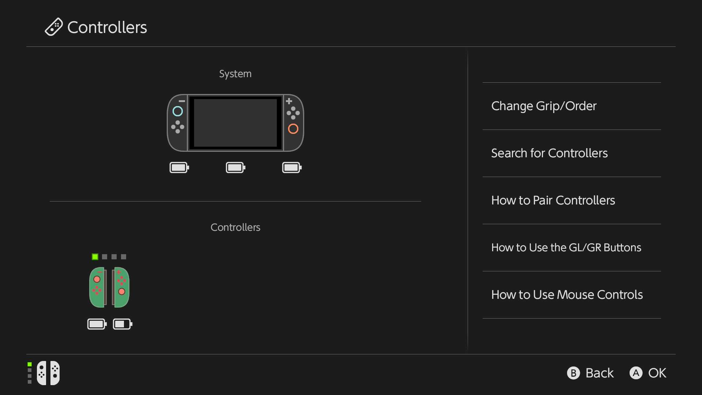
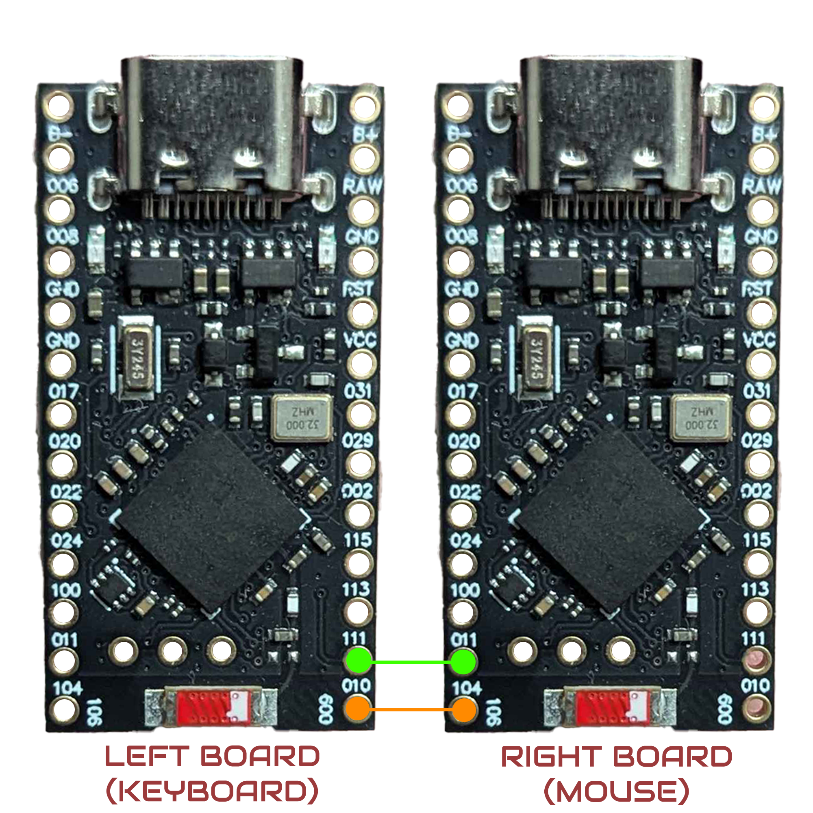
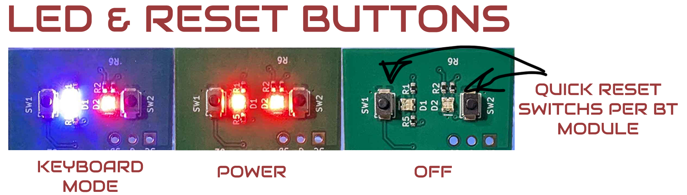

This firmware makes 2 nRF52840 chips appear to a Switch 2 as a left and right Joy-Con.
The left side is the Bluetooth keyboard, the right as the Bluetooth mouse. The inputs can link with each other making it possible to have the Keyboard (left Joy-Con) send (right Joy-Con) input like A, B, X, Y, etc. making up for the little amount of inputs on most mice. It runs on a pair of Pro Micro nRF52840 boards and everything is set up in the browser with
the [XD2Joy Web tool](https://desktopsetup.github.io/XD2Joy-Webtool/) making it more customizable. The **XD2Joy dongle** will be a
consumer friendly version that is in development and is ran on this same firmware.

## Contents

- [Features](#features)
- [Known bugs](#known-bugs)
- [Hardware](#hardware)
- [Dongle vs DIY setup](#dongle-vs-diy-setup)
- [Setup](#setup)
- [Building](#building)
- [Flashing the firmware](#flashing-the-firmware)
- [Using it in the web tool](#using-it-in-the-web-tool)
- [Notes and limits](#notes-and-limits)
- [License](#license)

## Features
- **Battery:** The firmware reads the BT devices battery health for the console to understand.
- **Remapping:** Map any key or mouse button to any Joy-Con button.
- **Input stacking:** You can stack 2 inputs on 1 button (e.g, Right Click + J = Y button) if you wanted to use both inputs the same.
- **Custom Hotkeys:** Set up key binds for each mode or profiles in the web tool
- **Keyboard mode:** The left half acts as a USB plugged keyboard for typing.
- **Unpairing:**  If you want to disconnect from the console fully holding F12 removes the devices from the console.
- **Crossmapping:** A keyboard can send A, B inputs and still act as the left Joy-Con, its vice versa for the mouse too.
- **Mouse mode:** A Bluetooth mouse emulates the Joy-Cons mouse state.
- **Thumbstick mode:** A mouse can also control the right stick.
- **Charging Grip:** Toggle the Charging Grip for extra GL and GR buttons and set up in the consoles quick settings.
- **Profiles:** 4 is the default max, setup key shortcuts in the Web-Tool.
- **Stored on Board:** Mapping, profiles and pairings are still saved on restarts and firmware updates.
- **Wake:** Wake up the console with home button.
- **Reconnecting:** If you do a soft removal of the paired devices they reconnect back to the console based on if you interact with them like a Joy-Con would.
- **Colors:** You can change Joy-Con colors when the devices are paired to the console.





## Bugs

- **Connecting:** Sometimes when you do a fresh disconnect or new pair to the console only 1 of the Bluetooth devices pair and it takes backing out a couple times for it to recognize the other one.
- **Snapping on slow mouse movement:** slow movements can snap visually, in both Mouse Mode and Thumbstick Mode. The Thumbstick Mode has a setting in the Web-Tool that helps.
- **Misread inputs in games:** Certain conditions from the keyboard/mouse or the game receives inputs that never are actually sent to the console but show up in game and not outside of it.
- **Pairing notification:** pairing notification might be off or consistent.
- **Bad Delay for some situations:** Most input delays are fixed but delay can still happen (e.g, pairing too many Joy-Cons or turning the console on and off and reconnecting.) was an issue and other situations like this could also trigger a bad delay but repairing always fixes it. 
- **Connection status on BT devices:** A keyboard or mouse with a LED status for being connected to something wont get trigged being connected to the switch 2 but still functions.

## Hardware

2 Pro Micro-style nRF52840 boards one for each Joy-Con the left board takes the keyboard, the right board the mouse. Wire them like this:



Make sure the wires make good contact if they touch each other it can feel like a firmware bug with random inputs sent to the console sometimes. Both boards should share the same ground, so if you for whatever reason have them in 2 separate power sources wire them with GND.

## Dongle vs DIY setup



The **XD2Joy dongle** is a more convenient and practical use of this firmware that is in development. One USB stick with 2 nRF52840 modules on the USB dongle. It runs this same firmware, with only the switches and lights on the dongle, so all the other features are about the same. 

What the dongle changes:

| | DIY pair | XD2Joy dongle |
|---|---|---|
| Setup | inconvenient. | plug & Config in Web-Tool & play |
| Bridging inputs | need wires to bridge the cross mapping function | built into the board |
| USB | a cable for each board | Single USB-A plug |
| Firmware updates | connect RST to GND twice on each board to reset the boards for uf2 uploads | reset button is a double click |
| Indicator | one LED per board used for keyboard mode and bootloader | a blue and a red LED for running, Blue LED for keyboard mode and bootloader |

## Setup

Tested with:

| tool | version |
|---|---|
| Zephyr | `main` at `434233e9751e7cca7bea82047e812bca607722d3` + the 2 patches |
| Zephyr SDK | 1.0.1 |
| west | 1.5.0 |
| CMake | 4.4.3 (3.20 or newer is required) |
| Ninja | 1.13.2 |
| Python | 3.13.5 and 3.14.8 (3.12 or newer is required) |
| Git | 2.50 |

**Before you start**

- Install **Python** (3.12 or newer) and **Git** https://git-scm.com/install/windows. CMake and Ninja.
- On Windows also install 7-Zip cause the Zephyr SDK comes as a .7z file

  ```powershell
  winget install 7zip.7zip
  $env:Path += ";C:\Program Files\7-Zip"
  ```

  The second line adds 7-Zip to that terminal session so dont forget to use it !

**1. Create a Zephyr workspace**

if you downloaded the repo, cd into it and install this

```sh
pip install west cmake ninja
git clone https://github.com/zephyrproject-rtos/zephyr zephyrproject/zephyr
cd zephyrproject/zephyr
git checkout 434233e9751e7cca7bea82047e812bca607722d3
cd ..
west init -l zephyr
west config manifest.project-filter -- "-.*,+cmsis_6,+hal_nordic,+mbedtls,+mldsa-native,+tf-psa-crypto"
west update --narrow -o=--depth=1
west packages pip --install --ignore-venv-check
west zephyr-export
west sdk install -t arm-zephyr-eabi
```

If `pip install` dont work look up a yt tutorial or some.

**2. Apply the Zephyr patches**

Replace `/path/to/this/repo` with where you downloaded this repo locally.

```sh
cd zephyr
git apply /path/to/this/repo/zephyr_patches/5ms.patch
git apply /path/to/this/repo/zephyr_patches/wider_transmit.patch
cd ../..
```

If you dont patch Zephyr this will **NOT** compile !

## Building

in Git Bash on Windows dont cd inside \firmware or \zephyrproject folders or it messes up be in XD2Joy :

```sh
ZEPHYR_WORKSPACE="$PWD/zephyrproject" bash firmware/build.sh
```

The script wants the Zephyr workspace at `~/zephyrproject`, so `ZEPHYR_WORKSPACE` tells it the one from step 1 is in this repo. If yours is somewhere else:

```sh
ZEPHYR_WORKSPACE=/path/to/zephyrproject bash firmware/build.sh
```

If it stops right away with "BT_HCI_LE_INTERVAL_MIN is not 0x0004" after a "No such file or
directory" line check your `ZEPHYR_WORKSPACE`.

If it worked it should be in `firmware/out/` :

| file | flash it onto |
|---|---|
| `xd2joy_LEFT.uf2` | the left board (keyboard) |
| `xd2joy_RIGHT.uf2` | the right board (mouse) |

building just 1 side of the firmware inside the Zephyr workspace:

```sh
west build -b promicro_nrf52840/nrf52840/uf2 -d build/xd2joy_left "/path/to/this/repo/firmware" --pristine -- -DJC_LEFT=1
west build -b promicro_nrf52840/nrf52840/uf2 -d build/xd2joy_right "/path/to/this/repo/firmware" --pristine
```

`-DJC_LEFT=1` builds the left half (keyboard) leave it out for the right half (mouse). The
image to flash is `build/<name>/zephyr/zephyr.uf2`. Use `--pristine`, or a new `-d` folder,
whenever you change options or apply patches.

it will be mixed in the files in `\zephyrproject\build_xd2joyL\zephyr\zephyr.uf2`

example 

```sh
west build -b promicro_nrf52840/nrf52840/uf2 -d build/xd2joy_left "C:\Users\Desktopsetup\Desktop\XD2Joy\firmware" --pristine
-- west build: making build dir C:\Users\straw\desktop\MALOFwo\zephyrproject\zephyr\build\xd2joy_left pristine
-- west build: generating a build system
Loading Zephyr default modules (Zephyr base).
```

## Flashing the firmware

1. **Enter the bootloader:** connect RST and GND at the same time twice quickly
2. A USB drive named **NICENANO** should appear when its reset.
3. Copy the `.uf2` firmware into the boards folder you just reset, once you drag and drop it into the boards bootloader The board restarts running the new firmware.

Do one board at a time both show up as a drive named NICENANO. So try and keep track on what one you reset/flashed and wired correctly.

### Using it in the web tool

Open [XD2Joy-WebTool](https://desktopsetup.github.io/XD2Joy-Webtool/) in Chrome on a computer make sure both boards are still connected to the PC. press **Connect** and
both boards should load in for managing buttons, profiles, selecting the BT keyboard and mouse devices and switch modes all that. The Web-Tool talks to
the boards over USB so you can pair the devices in the webtool and the console as well so you can see live in the Web-Tool what is working and being sent and configure it live for the console.

### Pairing a keyboard and mouse

Pair the keyboard or mouse into its Bluetooth pairing mode near the board. Then pick what Joy-Con it should emulate being Keyboard = Left Joy-Con, mouse = Right Joy-Con

### Pairing with the Switch 2

On the console, open **Controllers**, then **Change Grip/Order**. A Joy-Con should appear depending on what device is being used first and they should combine with each other or you could connect them separate if you wanted to. if its not getting detected try putting it in pair mode and make sure its working on the Web-Tool.

To pair with a different console, hold the pairing key for 2 seconds: **F12** by default or if your keyboard is wack hold FN + F12, but you can always change it.

## License
[LICENSE](LICENSE)

The firmware is free software under the GNU General Public License. You can use it, change it and share it, as long as what you share stays under the same license, but with no warranty.

Only the firmwares own code is under that license. The patches in `zephyr_patches/` change
Zephyr itself keep Zephyrs Apache 2.0 license

`XData_right.h` and `XData_left.h` is real data captured from Joy-Con 2 controller its included so the firmware can talk to the console.
